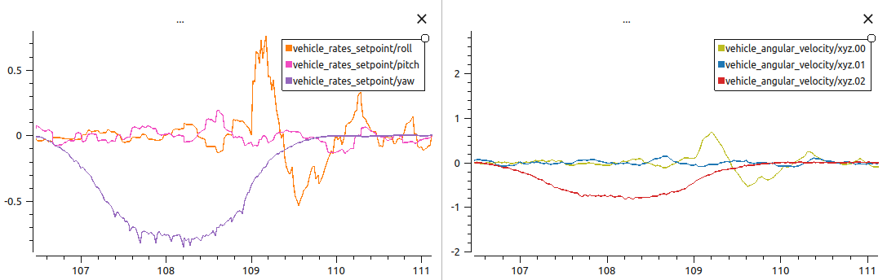
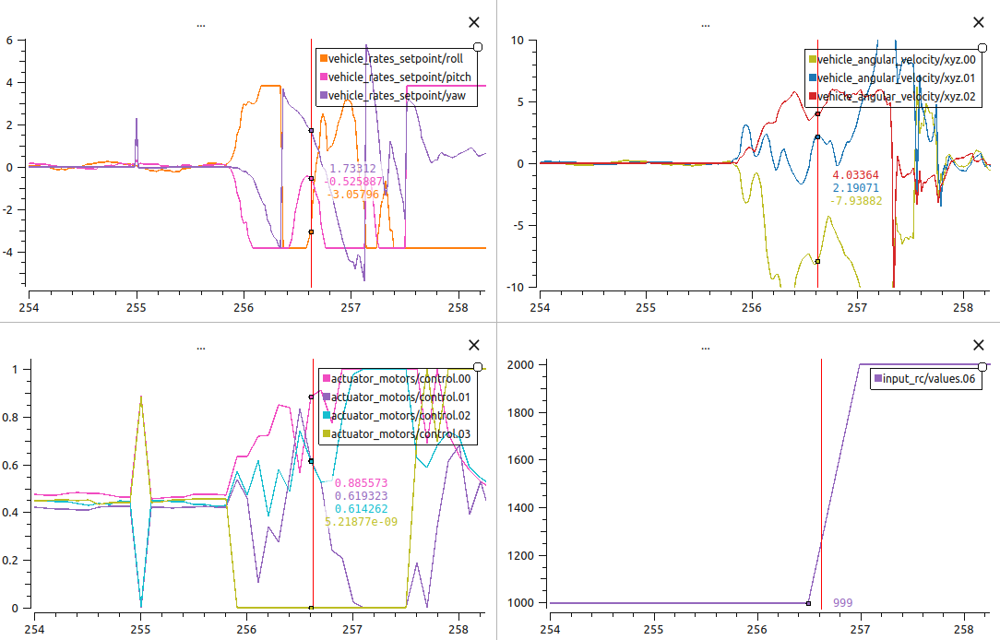
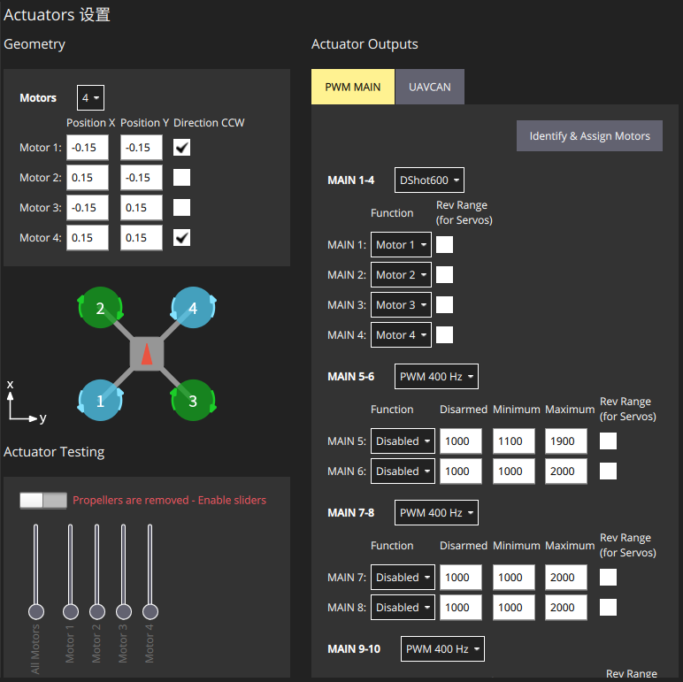
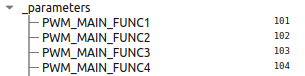
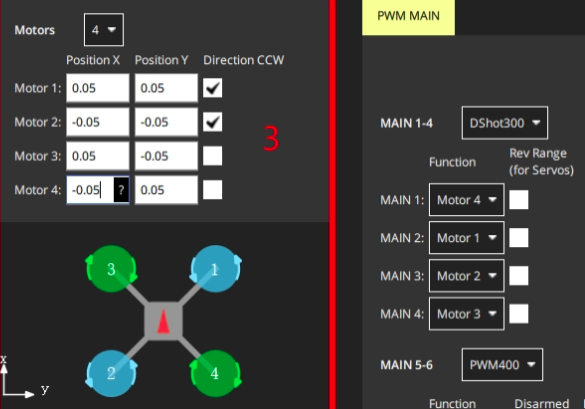
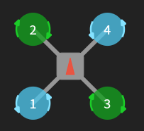
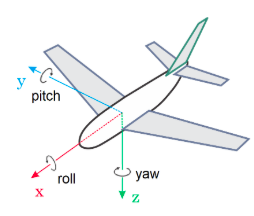
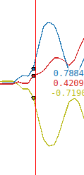

+++
title = "PX4失控排查（未完全解决）"
date = 2026-06-20
description = ""
[taxonomies]
tags = ["硬件","失控"]
+++

7h飞龄老飞机在室外飞行时突然爆鸣，然后螺旋式失控，已确定是底层问题，上层略有卡顿但是正常

<!--more-->

## 问题

**日志**： log_472_2026-6-18-07-53-30.ulg

**具体内容：**飞机在室外飞行时突然爆鸣，然后螺旋式失控

## 日志分析

`rosrun plotjuggler plotjuggler`

拖入日志，右侧图形栏右键分割画面

### 看控制输出

`actuator_motors/control` 是飞控 thrust 比例输出，向下 `actuator_motors/output` 就是通过油门解析的 PWM ，然后驱动把他发给电调

### 看飞机角速度响应

`vehicle_angular_velocity`

Bias corrected angular velocity about the FRD body frame XYZ-axis in rad/s

设备角速度，Bias corrected指陀螺仪数据做了偏差修正，FRD：Front、Right、Down

**Tip** 可能数据有异常值 y轴数据 range 很大，右键对应窗口 `Edit curves` Vertical Limits里面限制下窗口最大最小值就行

### 看飞机角速度控制

搜索 `rate` ，找到 `vehicle_rates_setpoint`

可以通过看前面的正常控制链确定都是谁跟谁：xyz.0 跟 roll ; xyz.1 跟 pitch ; xyz.2 跟 yaw 

即： **绿跟橙，蓝跟粉，红跟紫**



### 看遥控锁死时刻

不看 `vehicle_status/arming_state`， 应该看飞控什么时候给的锁桨命令，给了命令立刻 `actuator_motors/output` 没输出了

确定遥控哪个是锁，查参数 `RC_MAP_KILL_SW` =7 

飞控给的值看 `input_rc/values.06`

### 整体分析



可以看到大概 256.5 KILL，256 时 `control.3=0` ，**给4号电机0油门**

再看上面的控制跟随，256-256.5 绿不跟橙，蓝不跟粉，红不跟紫，全发散，飞机失控

### 硬件排查

#### 确定0油门电机位置

先确定 MAIN 到 Motor 的映射，MAIN是物理位置，MOTOR是逻辑电机。直接看飞机图就是逻辑位置，**4号电机就是**





**Tip MAIN 到 Motor 的映射**

而如果（网图）



```python
# 图中是
MAIN1: Motor 4
MAIN2: Motor 1
MAIN3: Motor 2
MAIN4: Motor 3
# 参数就是
PWM_MAIN_FUNC1 = 104
PWM_MAIN_FUNC2 = 101
PWM_MAIN_FUNC3 = 102
PWM_MAIN_FUNC4 = 103
# 104 是逻辑编号
```

所以看PX4文档，**ActuatorMotors (UORB message)**

```python
uint8 ACTUATOR_FUNCTION_MOTOR1 = 101 # output_functions.yaml Motor.start
```

是控制的逻辑电机开头

！！！

**但是我觉得我完全没必要做4号电机的测试，因为px4给的控制量就是0，不是说4号电机就是坏了，真正应该看的应该是2号电机，飞控希望2号电机增加4号电机减小，拉回姿态但是失控了，应该是2号电机更像有问题**

！！！

继续分析，右上置0，其他3个电机增加，（降前）就是减少上仰力矩，（降右）就是减少左滚力矩

然后旋转力距



```python
Motor 1 左后：CCW
Motor 2 左前：CW
Motor 3 右后：CW
Motor 4 右前：CCW

M1/M4 空气给桨反扭矩：CW	
M2/M3 空气给桨反扭矩：CCW	这个力将作用到机体

提高 CCW 电机 M1/M4 机体增加 CW 力矩
```

但是4个电机都在动，看不明白，但是看起来整体是在增加CCW



控制目标是：

roll +

pitch -

yaw看不清



确实符合，感觉是2号电机出问题了

#### 空载测试

都能正常提速，但是用手转2号电机的时候能感觉到明显卡顿，他嫌疑最大（带验证，应该换新电机上去，好了就说明就是他的问题）
