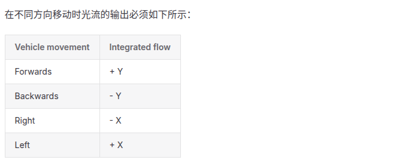

+++
title = "PX4光流水平轴数据验证"
date = 2026-03-12
description = ""
[taxonomies]
tags = ["硬件"]
+++

integrated_x 本身很难观察，所以观察累计值

<!--more-->

安装光流后发现 **x-y轴** 定不准，使用下面的文件获得累加的 **integrated_x** 和 **integrated_y** 。

*flow_check.py*

```python
import os
# 强制开启 MAVLink 2.0 协议
os.environ["MAVLINK20"] = "1"

import time
import matplotlib.pyplot as plt
from pymavlink import mavutil

# --- 配置连接 ---
CONNECTION_STRING = '/dev/ttyACM0'
BAUD_RATE = 115200  

print(f"正在连接到 {CONNECTION_STRING} ...")
master = mavutil.mavlink_connection(CONNECTION_STRING, baud=BAUD_RATE)

print("等待心跳包 (Heartbeat)...")
master.wait_heartbeat()
print("已连接到飞控！正在等待 OPTICAL_FLOW_RAD 数据...\n")

# --- 数据存储 ---
times = []
sum_x_list = []
sum_y_list = []
distance_list = []

current_sum_x = 0.0
current_sum_y = 0.0

# --- 初始化绘图 ---
plt.ion() # 开启交互模式
fig, (ax1, ax2) = plt.subplots(2, 1, figsize=(10, 8))
fig.canvas.manager.set_window_title('PX4 光流数据验证')

line_x, = ax1.plot([], [], label='Cumulative integrated_x', color='r')
line_y, = ax1.plot([], [], label='Cumulative integrated_y', color='b')
line_dist, = ax2.plot([], [], label='Distance (m)', color='g')

ax1.set_title("Optical Flow Cumulative X & Y (Auto-scaling)")
ax1.set_ylabel("Accumulated Rad")
ax1.legend()
ax1.grid(True)

ax2.set_title("Optical Flow Distance")
ax2.set_xlabel("Time (messages)")
ax2.set_ylabel("Distance (m)")
ax2.legend()
ax2.grid(True)

count = 0

try:
    while True:
        # 非阻塞读取 OPTICAL_FLOW_RAD 消息
        msg = master.recv_match(type='OPTICAL_FLOW_RAD', blocking=False)
        if msg:
            count += 1
            
            # 累加 x 和 y
            current_sum_x += msg.integrated_x
            current_sum_y += msg.integrated_y
            
            times.append(count)
            sum_x_list.append(current_sum_x)
            sum_y_list.append(current_sum_y)
            distance_list.append(msg.distance)
            
            # 保持列表不会无限变大导致内存崩溃（保留最近1000个点，可按需修改）
            if len(times) > 1000:
                times.pop(0)
                sum_x_list.pop(0)
                sum_y_list.pop(0)
                distance_list.pop(0)

            # 每接收 1 个数据包刷新一次图表（避免刷新过快卡顿）
            if count % 1 == 0:
                line_x.set_data(times, sum_x_list)
                line_y.set_data(times, sum_y_list)
                line_dist.set_data(times, distance_list)
                
                # 动态缩放 X 轴
                ax1.set_xlim(times[0], times[-1])
                ax2.set_xlim(times[0], times[-1])
                
                # 动态缩放 Y 轴 (这就是你需要的自动缩放)
                ax1.relim()
                ax1.autoscale_view(scalex=False, scaley=True)
                ax2.relim()
                ax2.autoscale_view(scalex=False, scaley=True)
                
                plt.pause(0.001)

except KeyboardInterrupt:
    print("检测到退出指令，结束捕获。")
    plt.ioff()
    plt.show()
```


**向前 integrated_y 增加，向右 integrated_x 增加** ，说明数据正确。凭直接会觉得这样是不是反了，但是没反， **x和y** 是指绕着这个轴（RH右手坐标系）旋转：

https://mavlink.io/en/messages/common.html#OPTICAL_FLOW_RAD


https://docs.px4.io/main/zh/sensor/optical_flow


